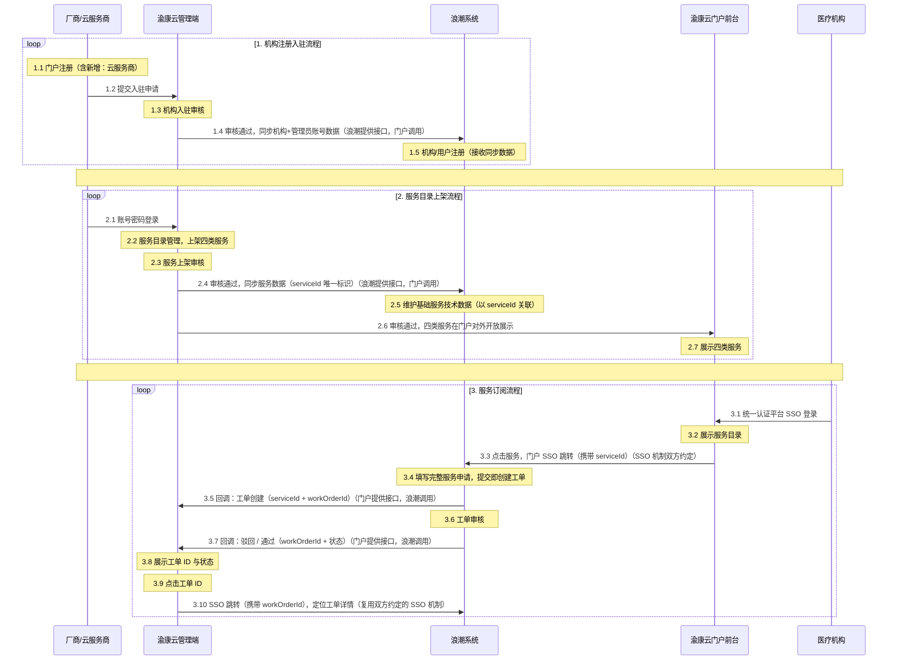

# 渝康云门户 × 浪潮系统 对接接口需求文档

| 项目 | 内容 |
| --- | --- |
| 文档性质 | 接口需求梳理稿（供与浪潮对齐用） |
| 门户侧系统 | 渝康云门户前台（cq-network-org-view）+ 管理端（cq-network-admin-view） |
| 对接方 | 浪潮（云平台/工单系统） |
| 更新日期 | 2026-08-19 |

---

## 1. 背景与整体流程




---

## 2. 对接事项总览

| # | 事项 | 类型 | 谁提供 | 状态 |
| --- | --- | --- | --- | --- |
| 1 | 云服务商注册字段 | 协同事项（非接口） | 浪潮提供字段清单 | 已完成 |
| 2 | 机构 + 管理员账号数据同步 | 具体接口 | 浪潮提供接收接口 | 已完成 |
| 3 | 基础服务目录字段 | 协同事项（非接口） | 部分参考政务云服务目录，**部分待浪潮提供** | 已完成 |
| 4 | 四类服务上架数据同步 | 具体接口 | 浪潮提供接收接口 | 已完成 |
| 5 | 门户 -> 浪潮 用户填写服务申请（SSO 跳转） | 协同事项（约定认证机制） | 双方约定 | 已完成 |
| 6 | 工单创建/状态变更通知 | 具体接口 | **门户提供回调接口，浪潮调用** | 已完成 |
| 7 | 工单详情查看跳转（带工单ID） | 协同事项（依赖 #5 的 SSO 机制） | 双方约定 | 已完成 |

---

## 3. 对接事项明细

### 3.1 云服务商注册字段（#1 · 协同事项）

现有服务提供方注册字段（供浪潮参考对齐）：

| 字段名 | 字段中文名 | 说明 |
| --- | --- | --- |
| unitName | 单位名称 | 必填 |
| legalPerson | 法定代表人 | 必填 |
| creditCode | 社会统一信用代码 | 必填，18 位 |
| unitNature | 单位性质 | 必填，多选：国有 / 民营 / 三资 / 其他 |
| establishDate | 成立时间 | 格式 yyyy-MM-dd |
| registerAddress | 单位注册地 | 必填，省 / 市 / 区 / 详址 |
| unitAddress | 单位地址 | 必填，省 / 市 / 区 / 详址 |
| contactName | 联系人姓名 | 必填 |
| contactPhone | 联系人电话及手机 | 必填 |
| contactDuty | 联系人职务 | 选填 |
| contactEmail | 联系人 E-mail / 微信号 | 选填 |
| companyIntro | 企业简介 | 必填，≤400 字 |
| productIntro | 主要产品或服务介绍 | 选填，≤400 字 |
| hrIntro | 人力情况介绍 | 选填，≤400 字 |
| commitmentFile | 《真实性承诺》附件 | PDF/JPG/PNG，≤10MB，需法人签章 + 公章 |
| adminName | 管理员姓名 | 必填 |
| adminIdCard | 管理员身份证号 | 必填，18 位 |
| adminPassword | 管理员密码 | 必填，6-20 位 |
| adminPhone | 管理员手机号 | 必填 |


### 3.2 机构 + 管理员账号数据同步（#2 · 接口）

**场景**：机构入驻审核通过后，门户将机构数据 + 管理员账号数据推送浪潮，由浪潮完成机构注册和用户注册（为厂商后续 SSO 登录浪潮维护数据做准备）。

**提供方**：浪潮提供接收接口，门户调用。

**建议定义**（路径以浪潮实际为准）：

```
POST /open/api/org/sync
```

| 字段名 | 字段中文名 | 说明 |
| --- | --- | --- |
| orgId | 机构唯一标识 | **主键**，门户生成，后续所有关联以此为准 |
| unitName | 单位名称 | |
| legalPerson | 法定代表人 | |
| creditCode | 社会统一信用代码 | 18 位 |
| unitNature | 单位性质 | 国有 / 民营 / 三资 / 其他 |
| establishDate | 成立时间 | yyyy-MM-dd |
| registerAddress | 单位注册地 | 省市区 + 详址 |
| unitAddress | 单位地址 | 省市区 + 详址 |
| contactName | 联系人姓名 | |
| contactPhone | 联系人电话及手机 | |
| contactDuty | 联系人职务 | |
| contactEmail | 联系人 E-mail / 微信号 | |
| companyIntro | 企业简介 | ≤400 字 |
| productIntro | 主要产品或服务介绍 | ≤400 字 |
| hrIntro | 人力情况介绍 | ≤400 字 |
| qualificationFiles | 资质材料附件 | 《真实性承诺》等 |
| adminName | 管理员姓名 | 管理员账号数据 |
| adminIdCard | 管理员身份证号 | |
| adminPhone | 管理员手机号 | |
| adminPassword | 管理员密码凭据 | 建议改为一次性激活票据，见待确认 |

**结论**：

- 接口调用失败容错机制由各个接口提供方直接通过apipost中进行注释说明，后续接口都统一在apipost对接。

### 3.3 基础服务目录字段（#3 · 协同事项）

门户现有基础服务表单/详情字段：

| 字段名 | 字段中文名 | 说明 |
| --- | --- | --- |
| serviceName | 基础服务名称 | 必填，≤40 字 |
| logo | 服务 LOGO | 图片 |
| description | 服务描述 | 必填 |
| sortOrder | 显示顺序 | |
| vendor | 服务商名称 | |
| contact1 | 联系方式 1 | |
| contact2 | 联系方式 2 | |
| serviceType | 服务子类 | 必填，多选：计算服务 / 存储服务 / 网络服务 / 安全服务 / 大数据服务 / 数据库服务 / 备份容灾服务 / 软件与应用服务 / 机房托管服务 |
| cloudProvider | 部署云服务商 | 必填，多选：影像云 / 电信云 / 移动云 / 联通云 / 浪潮云 |
| region | 区域 | 必填，多选：华东 / 华北 / 华南 / 西南 |
| serviceLevel | 服务等级 | |
| serviceScope | 服务范围 | |

**结论**：

- 字段参考「重庆市政务云服务目录」。

### 3.4 四类服务上架数据同步（#4 · 接口）

**场景**：四类服务上架审核通过后，门户将服务数据全量推送浪潮。**以门户 `serviceId` 作为唯一标识**，浪潮侧以 serviceId 关联维护数据。

**提供方**：浪潮提供接收接口，门户调用。

**建议定义**：

```
POST /open/api/service/sync
Content-Type: application/json
```

| 字段名 | 字段中文名 | 说明 |
| --- | --- | --- |
| serviceId | 服务唯一标识 | **主键**，门户生成 |
| serviceCategory | 服务大类 | digitalApp（数字应用）/ securityService（安全服务）/ component（能力组件）/ basicService（基础服务） |
| orgId | 服务商机构标识 | 对应 3.2 的 orgId |
| serviceName | 服务名称 | |
| logo | 服务 LOGO | |
| description | 服务描述 | |
| ext | 各类型差异化字段 | JSON；basicService 至少含：服务子类、部署云服务商、区域、服务等级、服务范围 |

**结论**：基础服务同步后由浪潮继续维护技术数据--建议浪潮侧建技术数据扩展表，以 `serviceId` 外键关联，门户不感知技术数据；针对技术数据还未维护的情况下，用户发起服务申请时需要进行限制；

### 3.5 门户 -> 浪潮 用户填写服务申请（#5 · 协同事项）

**场景**：医疗机构经统一认证平台 SSO 登录渝康云门户后，在门户点击某项服务，免登跳转到浪潮系统填写完整服务申请。

**结论**：

- 不涉及业务数据接口，但需双方约定统一的认证/跳转机制，与全市统一认证平台体系对齐。

### 3.6 工单创建/状态变更通知（#6 · 接口）

**场景**：医疗机构 SSO 跳转浪潮填写完整服务申请，提交即创建工单；此后工单驳回、审核通过等状态变化，均需通知门户侧（渝康云管理端）。

**提供方**：**门户侧（管理端）提供回调接口，浪潮主动调用**。

**建议定义**（门户侧接口，路径待定）：

```
POST /open/api/callback/workorder
```

| 字段名 | 字段中文名 | 说明 |
| --- | --- | --- |
| workOrderId | 工单唯一标识 | **主键**，浪潮生成，门户展示并用于跳转 |
| serviceId | 服务标识 | 对应 SSO 跳转时携带的 serviceId，用于绑定 |
| orgId | 申请机构标识 | |
| eventType | 事件类型 | CREATED（创建）/ REJECTED（驳回）/ APPROVED（通过）/ 其他（如取消） |
| eventTime | 事件时间 | |
| remark | 备注 | 驳回原因 / 审核意见等 |

**结论**：

- 接口调用失败容错机制由各个接口提供方直接通过apipost中进行注释说明，后续接口都统一在apipost对接。

### 3.7 工单详情查看跳转（#7 · 协同事项）

**场景**：管理端展示工单 ID 与状态，点击工单 ID，免登跳转到浪潮工单系统并定位到该工单详情页。

**形式**：复用 3.5 的 SSO 机制，跳转时携带 `workOrderId` 定位工单，无需额外接口。


---


